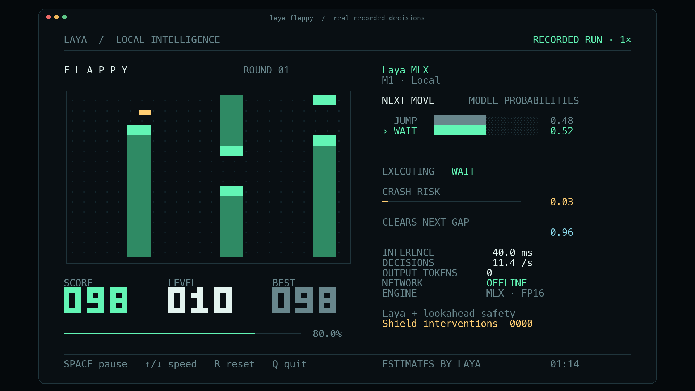

# Laya Flappy: local terminal demo

A Flappy game driven by Laya MLX predictions on Apple silicon, using the same terminal layout, controls, recording format and evidence rules as the [Snake demo](SNAKE_DEMO.md). The left panel shows the board, score, level and best score. The right panel shows the two action probabilities, the executed action, two model estimates, measured inference time, decision rate and local/offline status.



## Run

From this repository on an Apple silicon Mac:

```bash
uv run --extra demo laya-flappy
```

The default model is `aac6fef/laya-multilingual-mlx`, using the original FP16 weights, exactly as in the Snake demo. The demo first checks `models/hub/laya-multilingual-mlx` and `models/laya-multilingual`, then the local Hugging Face cache. It never downloads a missing model during play. On a fresh checkout, download the weights once beforehand:

```bash
uv run --extra demo hf download aac6fef/laya-multilingual-mlx \
  --local-dir models/hub/laya-multilingual-mlx
uv run --extra demo laya-flappy
```

Use a terminal at least **104 columns × 35 rows** with a monospace font and true color. A smaller terminal pauses the game until resized. Default board size is 24 × 16 cells, the first gap is 5 rows tall, and the presentation target is 12 decisions/second.

The live display respects `NO_COLOR`. If your shell sets it, use `env -u NO_COLOR uv run --extra demo laya-flappy` for the colored presentation.

| Control | Action |
|---|---|
| Space | Pause / resume |
| ↑ / ↓, or + / − | Increase / decrease the paced target by 2 decisions/second |
| R | Start a new round with the next seed |
| Q or Ctrl-C | Quit and restore the terminal |

Useful modes:

```bash
# Every tick waits for a new inference, with no pacing delay.
uv run --extra demo laya-flappy --max-speed

# Optional measured compilation + prefix-reuse path.
uv run --extra demo laya-flappy --optimize --max-speed

# Use the fixed computation-budget setting validated on the recorded M1.
uv run --extra demo laya-flappy --fps 12

# Execute the model's raw first choice without the lookahead safety shield.
uv run --extra demo laya-flappy --unassisted

# A finite run without a terminal display.
uv run --extra demo laya-flappy --headless --steps 600 --max-speed
```

`--model` accepts a local directory or an already cached Hub ID. `--width`, `--height`, `--seed` and `--gap` configure a run. The gap must be at least 3 rows, the board at least 4 rows taller than the gap, and wide enough for the pipe spacing. Speed keys affect paced mode; `--max-speed` always advances as soon as the current decision is complete.

## The game

Integer physics in half-row units, one tick per decision. Jumping is the only control:

- `JUMP` gives an upward impulse of 1.5 rows/tick. `WAIT` means not jumping: gravity adds 0.5 rows/tick, capped at 2 rows/tick downward.
- A single jump therefore follows an arc: the bird climbs 3 rows while slowing down, pauses at the top, then falls faster and faster. The bird is drawn with half-row blocks so the arc is visible.
- Pipes are 2 cells wide and move one column per tick. Hitting a pipe, the ceiling or the floor ends the round.
- Gap position is drawn from three zones with equal probability: **against the ceiling, against the floor, or anywhere**. Consecutive gaps can therefore jump from the top of the board to the bottom.
- **Difficulty rises every 10 pipes**: the gap loses one row (5 → 4 → 3, minimum 3) and pipes come two columns closer (12 → 10 → 8, minimum 8). `LEVEL` and the progress bar under it show this.
- A requested gap is accepted only if the bird can still reach it from its current state. Otherwise the nearest reachable row is used. This keeps the shield complete: from any shielded state, a collision-free continuation exists over every known pipe.

## Record and export

The recording contains actual board states, original model probabilities, executed actions, timings, model provenance and run summaries. Each board is paired with the prediction made **before** its next tick. The format (`laya-flappy-v1`) is the Snake format with Flappy board snapshots.

```bash
uv run --extra demo laya-flappy --fps 12 --duration 100 \
  --record artifacts/flappy/run.jsonl

# ffmpeg is required for video export; on macOS: brew install ffmpeg
uv run --extra demo laya-flappy export artifacts/flappy/run.jsonl \
  --start 30 --seconds 30 --output artifacts/flappy/demo.mp4 \
  --gif artifacts/flappy/demo.gif

uv run --extra demo laya-flappy export artifacts/flappy/run.jsonl \
  --start 75 --output artifacts/flappy/poster.png
```

Export options, original-speed rules, the `RECORDED RUN · 1×` label and the JSON sidecar are identical to the [Snake export](SNAKE_DEMO.md#record-and-export). Output files are not overwritten.

## What the AI does

This is a **feature-assisted neural decision demo**, using the existing Laya checkpoint without Flappy training. A deterministic planner simulates both actions and searches every continuation over all known pipes. Laya receives those descriptions, including which safe action keeps the bird closest to the next gap center. It returns a distribution over `JUMP` and `WAIT`. The probability bars are those original model outputs.

The default safety shield executes the model's highest-probability admissible action. If the raw first choice is inadmissible, the UI keeps that original distribution and marks the executed action with `SHIELD`; the intervention counter increases. The default run is labeled `Laya + lookahead safety`. `--unassisted` disables that execution restriction; it still gives the model planner features. Neither mode establishes that the checkpoint can infer Flappy strategy from an unprocessed board.

One `Agent.predict` call batches three real questions per tick:

| Display | Actual meaning |
|---|---|
| NEXT MOVE | Laya `choice` probabilities over the two described actions |
| CRASH RISK | `1 − P(safe route available)`, from a Laya `noul` answer |
| CLEARS NEXT GAP | Laya `noul` answer about the supplied next-gap reachability |
| INFERENCE | Synchronized `Agent.predict` wall time, including tokenization and result conversion |
| DECISIONS | Recent measured completed-decision rate |
| NETWORK OFFLINE | Local checkpoint loading and local inference with Hub offline mode; this does not switch off the Mac's Wi-Fi |

The two estimates are model outputs, not calibrated crash probabilities. No random values or prerecorded predictions are substituted during live play.

### Prompt wording

The compact and detailed prompts use the Snake demo's structure and wording (`Blocked. Collision.`, `Unsafe. Traps the bird.`, `Safe. Best route.`, `Safe. Slower route.`). With two options, wording matters: in probes on this M1, descriptive geometry such as "3 rows above the gap center" or "Drifts away from the gap" produced chance-level choices on both published checkpoints. The Snake wording separated safe from unsafe options on both.

Action names matter too. In unshielded 500-tick games on three seeds, the multilingual checkpoint crashed within 155 ticks when the options were named `JUMP`/`FALL` and within 62 ticks with `HOP`/`FALL` in the detailed prompt. It agreed with the planner on every tick, in both prompts, with `JUMP`/`WAIT`, which the demo uses.

## Reproduce the speed test

```bash
uv run --extra demo laya-flappy benchmark \
  --rates 10,12,15,18,20,25,30,35,40,45,50,60 \
  --sweep-steps 120 --soak-steps 600 --seeds 101,102,103,104 \
  --output artifacts/flappy/benchmark.json
```

Method, pass criteria, `--resume` behavior and exclusions match the [Snake speed test](SNAKE_DEMO.md#reproduce-the-speed-test). The Flappy invariants are zero crashes under the shield and a passed pipe within every lookahead horizon.

The truecolor M1 run completed 8,160 decisions with zero deaths and zero interventions, including 2,400 uncapped steps at **25.79 steps/second overall**. Its highest passing tested computation-budget setting was **12 FPS**, with an achieved paced rate of **11.50–11.52 steps/second**. The 100-second showcase recording, at a 12 FPS target, reached score 134 and level 14 with zero deaths and zero interventions. See [Flappy speed and stability](FLAPPY_BENCHMARKS.md) for per-seed results and limitations.
