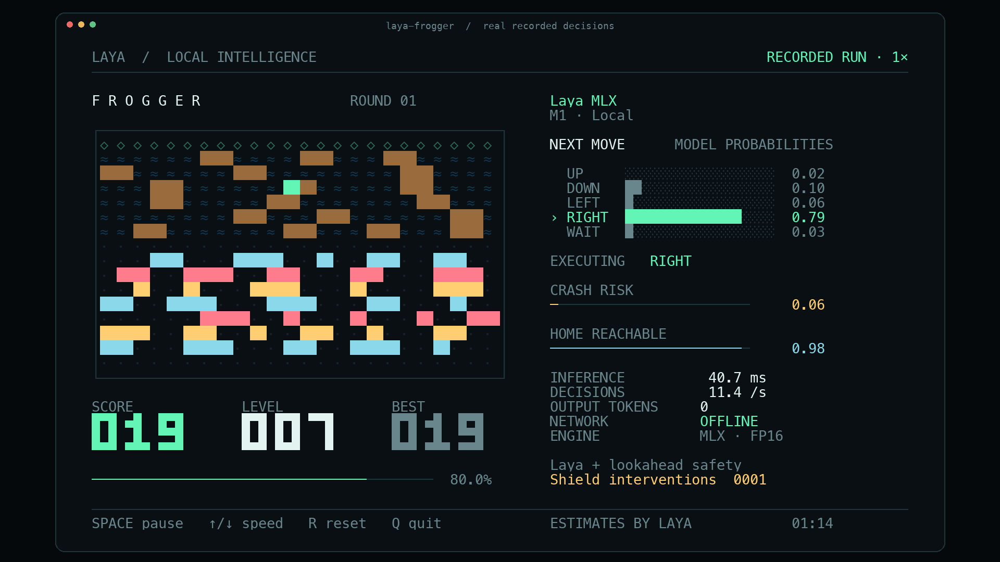

# Laya Frogger: local terminal demo

A Frogger game driven by Laya MLX predictions on Apple silicon, using the same terminal layout, controls, recording format and evidence rules as the [Snake demo](SNAKE_DEMO.md). The left panel shows the board, score, level and best score; the bar under them shows how far across the board the frog is. The right panel shows the five move probabilities, the executed move, two model estimates, measured inference time, decision rate and local/offline status.



## Run

From this repository on an Apple silicon Mac:

```bash
uv run --extra demo laya-frogger
```

The default model is `aac6fef/laya-multilingual-mlx`, using the original FP16 weights, exactly as in the Snake demo. The demo first checks `models/hub/laya-multilingual-mlx` and `models/laya-multilingual`, then the local Hugging Face cache. It never downloads a missing model during play. On a fresh checkout, download the weights once beforehand:

```bash
uv run --extra demo hf download aac6fef/laya-multilingual-mlx \
  --local-dir models/hub/laya-multilingual-mlx
uv run --extra demo laya-frogger
```

Use a terminal at least **104 columns × 35 rows** with a monospace font and true color. A smaller terminal pauses the game until resized. The board is 24 × 16 cells, like Snake's, and the presentation target is 12 decisions/second.

The live display respects `NO_COLOR`. If your shell sets it, use `env -u NO_COLOR uv run --extra demo laya-frogger` for the colored presentation.

| Control | Action |
|---|---|
| Space | Pause / resume |
| ↑ / ↓, or + / − | Increase / decrease the paced target by 2 decisions/second |
| R | Start a new round with the next seed |
| Q or Ctrl-C | Quit and restore the terminal |

Useful modes:

```bash
# Every move waits for a new inference, with no pacing delay.
uv run --extra demo laya-frogger --max-speed

# Optional measured compilation + prefix-reuse path.
uv run --extra demo laya-frogger --optimize --max-speed

# Use the fixed computation-budget setting validated on the recorded M1.
uv run --extra demo laya-frogger --fps 10

# The detailed prompt (see Prompt wording below).
uv run --extra demo laya-frogger --prompt detailed

# Execute the model's raw first choice without the lookahead safety shield.
uv run --extra demo laya-frogger --unassisted

# A finite run without a terminal display.
uv run --extra demo laya-frogger --headless --steps 600 --max-speed
```

`--model` accepts a local directory or an already cached Hub ID. `--width` and `--seed` configure a run; the board is always 16 rows tall. Speed keys affect paced mode; `--max-speed` always advances as soon as the current decision is complete.

## The game

- Row 0 is home, rows 1–6 are a river, row 7 is a safe median, rows 8–14 are a road and row 15 is the safe start.
- Moves are `UP`, `DOWN`, `LEFT`, `RIGHT` and `WAIT`. Leaving the board, being hit by a car, landing in the water or being carried off the edge by a log ends the round.
- Each lane is a cyclic pattern of cars or logs that shifts one cell every 1–4 ticks, alternating direction by row. A log carries the frog when its lane shifts.
- Reaching home scores one crossing and returns the frog to the start. **Every 3 crossings the level rises**: lanes are rebuilt with faster periods, shorter logs and denser cars. `LEVEL` shows this.

## Record and export

The recording contains actual board states, original model probabilities, executed actions, timings, model provenance and run summaries. Each board is paired with the prediction made **before** its next move. The format (`laya-frogger-v1`) is the Snake format with Frogger board snapshots.

```bash
uv run --extra demo laya-frogger --fps 12 --duration 100 \
  --record artifacts/frogger/run.jsonl

# ffmpeg is required for video export; on macOS: brew install ffmpeg
uv run --extra demo laya-frogger export artifacts/frogger/run.jsonl \
  --start 30 --seconds 30 --output artifacts/frogger/demo.mp4 \
  --gif artifacts/frogger/demo.gif

uv run --extra demo laya-frogger export artifacts/frogger/run.jsonl \
  --start 75 --output artifacts/frogger/poster.png
```

Export options, original-speed rules, the `RECORDED RUN · 1×` label and the JSON sidecar are identical to the [Snake export](SNAKE_DEMO.md#record-and-export). Output files are not overwritten.

## What the AI does

This is a **feature-assisted neural decision demo**, using the existing Laya checkpoint without Frogger training. A deterministic planner knows every future lane position exactly. By backward induction over a 32-tick lookahead, it marks which moves keep a safe row (the start or the median) reachable, and how many ticks each move needs to reach home. Laya receives those descriptions, including which safe move reaches home fastest. It returns a distribution over the five moves. The probability bars are those original model outputs.

The default safety shield executes the model's highest-probability admissible move. If the raw first choice is inadmissible, the UI keeps that original distribution and marks the executed move with `SHIELD`; the intervention counter increases. The default run is labeled `Laya + lookahead safety`. `--unassisted` disables that execution restriction; it still gives the model planner features. Neither mode establishes that the checkpoint can infer Frogger strategy from an unprocessed board.

The shield is complete: waiting on a safe row is always safe, and each admitted move keeps a path to a safe row inside the lookahead, so a safe move always exists. Tests exercise arbitrary safe choices over thousands of ticks.

One `Agent.predict` call batches three real questions per move:

| Display | Actual meaning |
|---|---|
| NEXT MOVE | Laya `choice` probabilities over the five described moves |
| CRASH RISK | `1 − P(safe route available)`, from a Laya `noul` answer |
| HOME REACHABLE | Laya `noul` answer about the supplied home reachability within the lookahead |
| INFERENCE | Synchronized `Agent.predict` wall time, including tokenization and result conversion |
| DECISIONS | Recent measured completed-decision rate |
| NETWORK OFFLINE | Local checkpoint loading and local inference with Hub offline mode; this does not switch off the Mac's Wi-Fi |

The two estimates are model outputs, not calibrated probabilities. No random values or prerecorded predictions are substituted during live play.

### Prompt wording

The prompts follow the Snake structure and safety wording (`Blocked. Collision.`, `Unsafe. Traps the frog.`). The label for the planner's preferred move was chosen by measurement on 450 real game states with the multilingual checkpoint:

| Prompt | Preferred / other safe label | Agreement with planner |
|---|---|---|
| compact | `Safe. Best route home.` / `Safe. Slower route.` | 94.0% |
| compact (**used**) | `Safe. Best move.` / `Safe. Slower route.` | 98.2% |
| detailed | `Safe. Best progress toward home.` / `Safe but less progress toward home.` | 27.6% |
| detailed (**used**) | `Safe. Fastest route home. Best move.` / `Safe but slower route home.` | 97.8% |

The detailed Snake-style wording ("best progress" / "less progress") was the weak case. In unshielded 400-tick games on three seeds with the labels used, the model never chose an unsafe move (989/989 and 966/966 decisions with at least one unsafe option). Agreement with the planner was 92.4% with the compact prompt (12–13 crossings per game) and 91.0% with the detailed prompt (13–14 crossings). The compact prompt stays the default, as in Snake.

## Reproduce the speed test

```bash
uv run --extra demo laya-frogger benchmark \
  --rates 10,12,15,18,20,25,30,35,40,45,50,60 \
  --sweep-steps 120 --soak-steps 600 --seeds 101,102,103,104 \
  --output artifacts/frogger/benchmark.json
```

Method, pass criteria, `--resume` behavior and exclusions match the [Snake speed test](SNAKE_DEMO.md#reproduce-the-speed-test). The Frogger invariant is zero deaths under the shield; crossings and the longest interval between them are reported, not required.

The truecolor M1 run completed 8,160 decisions with zero deaths and 9 shield interventions, including 2,400 uncapped steps at **18.94 steps/second overall**. Its highest passing tested computation-budget setting was **10 FPS**, with an achieved paced rate of **9.58–9.59 steps/second**. The default 12 FPS presentation target passed its short probe but exceeded the 1% late-tick limit on one of the longer seeds. The 100-second showcase recording, at a 12 FPS target, made 21 crossings and reached level 8 with zero deaths and 1 intervention. See [Frogger speed and stability](FROGGER_BENCHMARKS.md) for per-seed results and limitations.
